# Innocent Portfolio Frontend Part

Dynamic personal website with admin panel which contains educations, experiences, skills, projects, contact fields.

## Technologies

## MERN STACK: Mongo DB, ExpressJS, ReactJS, NodeJS

## Dependencies

* react
* redux
* react-redux
* redux-thunk
* react-router-dom
* react-hook-form
* axios
* moment
* react-datepicker
* react-dom
* react-icons
* react-modal-image
* react-scripts
* react-skillbars
* react-toastify
* web-vitals

## Project Screen Shots

### Intro

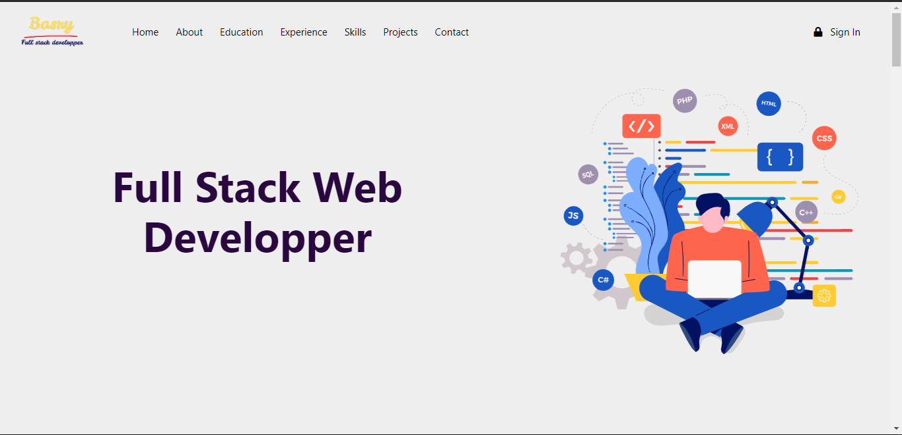

### About Me

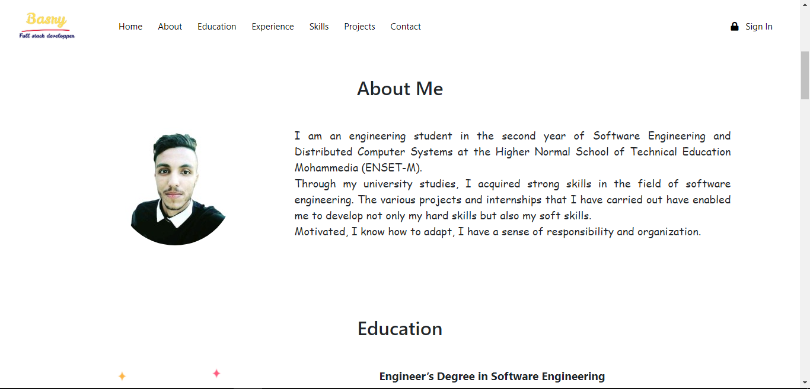

### Educations

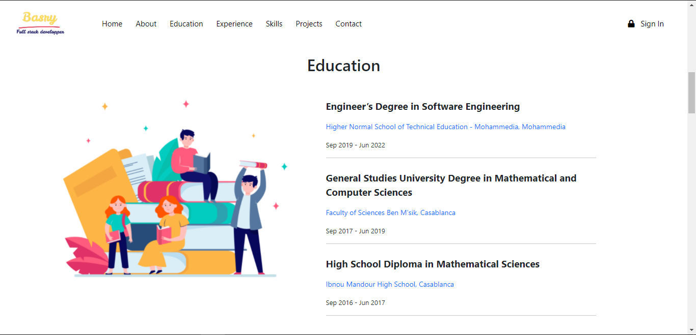

### Experiences

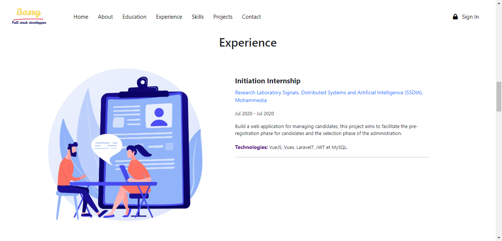

### Skills

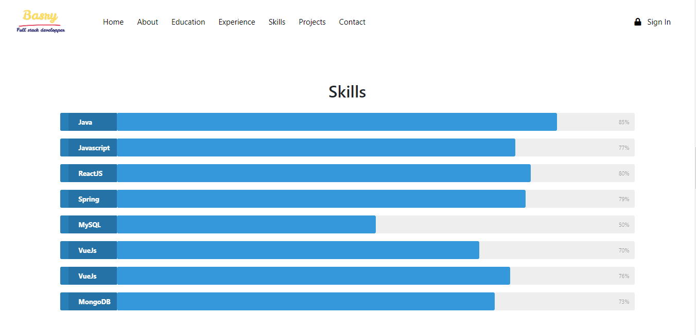

### Projects

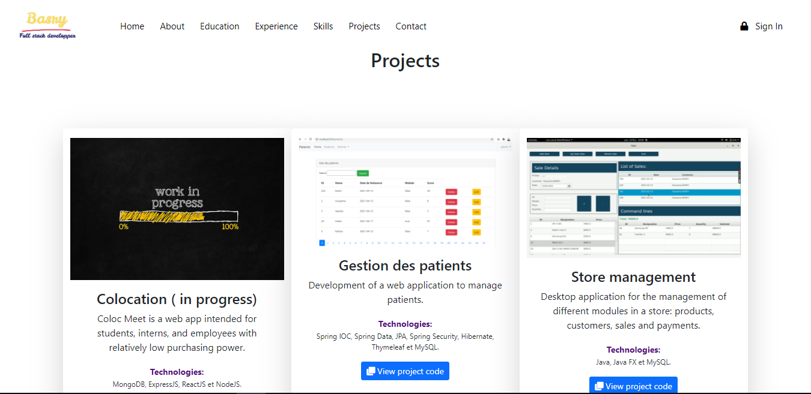

### Contact Me

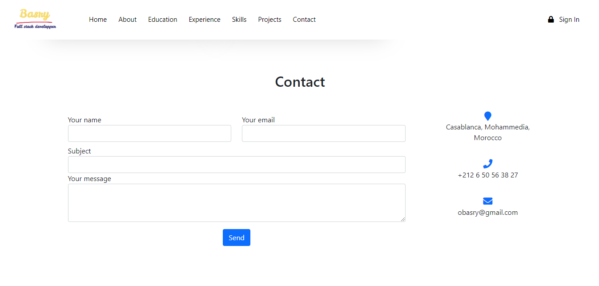

### Footer

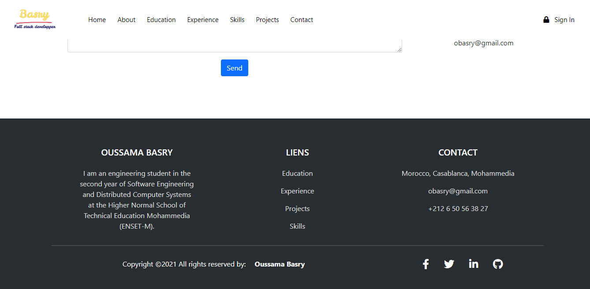

### Login Admin Page

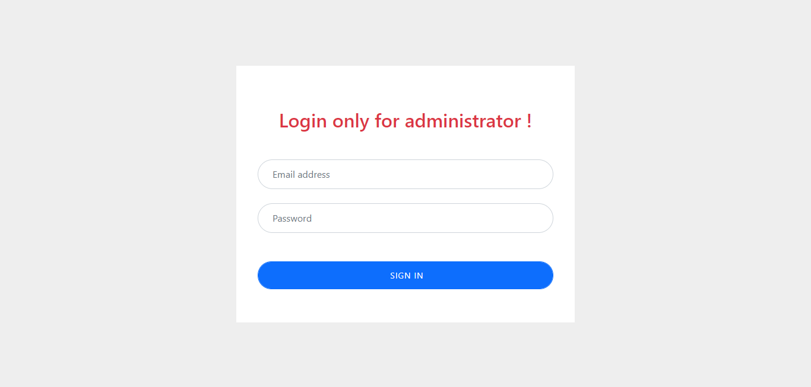

### Dashboard Admin

### Educations Admin

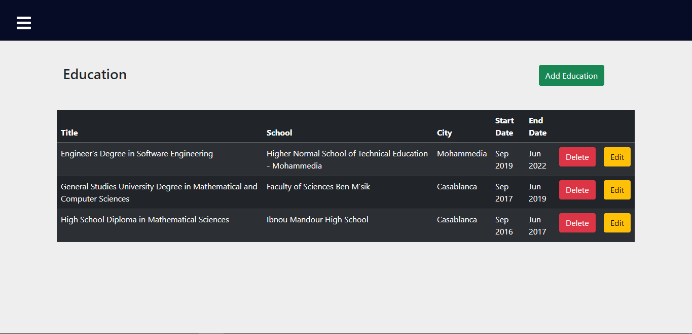

### Add Education

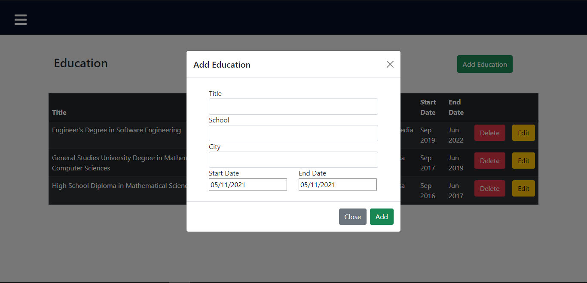

### Edit Education

### Experiences Admin

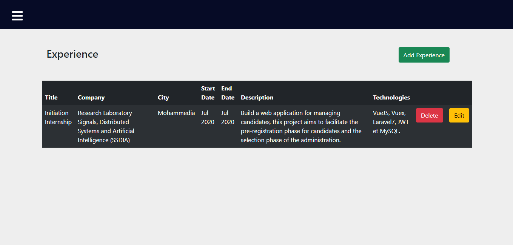

### Skills Admin

### Project Admin

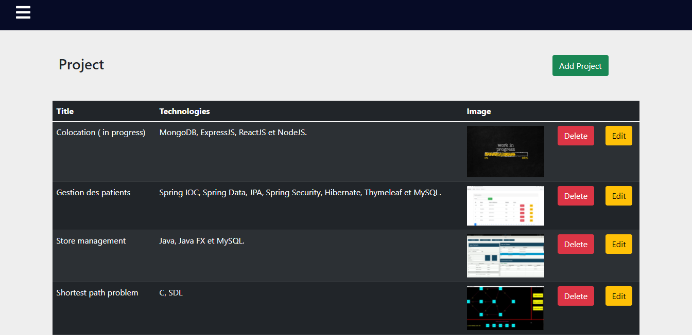

### Contact Admin

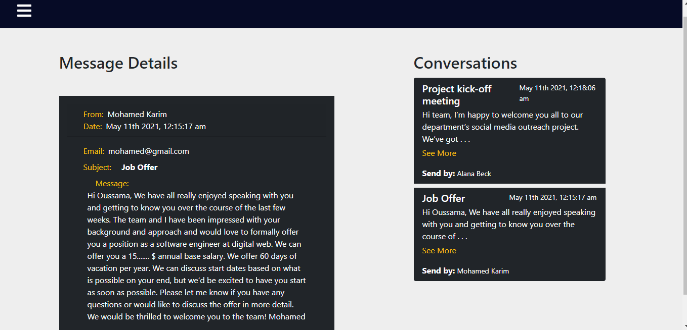

## Demo

Click [Demo](https://basry.herokuapp.com/) to go to the demonstration page.

## Installation and Setup Instructions

Clone down this repository. You will need `node` and `npm` installed globally on your machine.

Installation:

`npm install`

To Start Server:

`npm start`

To Visit App:

`localhost:3000/`

## Notes

* please note that the application will not work before colone the API express, click [here](https://github.com/Innocent-Omoding/portfolio-backend) to go to backend repository.
* Change the server IP address in /src/app/serverApi.js  file.
